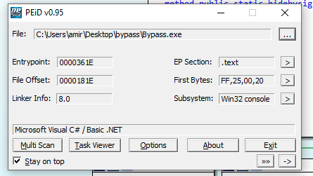
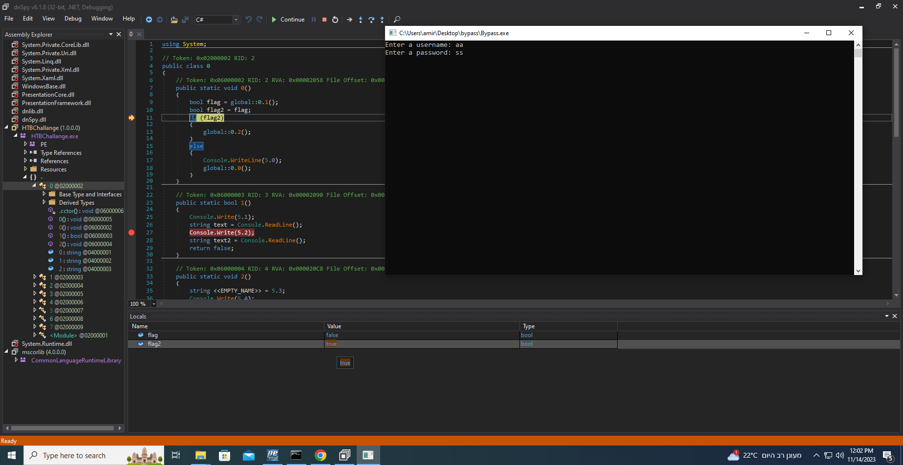

**<u>Bypass</u>:**

**Static analysis:**

After downloading the file from HTB we unzip it to find what looks like a PE for windows (.exe extension), since I'm currently working at a Linux environment I ran the file command to get more basic info about the file.

As you can see the file is indeed a windows PE 32 bit executable for the x86 architecture, I also ran it against strings to check if anything interesting pops up like the flag? but hopes get only get you this far, although I did found something potentially interesting a bunch of .NET prefix strings that could imply that it was developed with that framework.

I wanted to keep investigating the file so i transferred to my local virtual windows 10 environment for some extra tools for static and dynamic analysis. First I ran PEid against our file to check for packers or compilers used information, and as we suspected it was written in .NET with C#. We can also expect a command line only interface as indicated in the Subsystem.

**Dynamic analysis:**

When running the file we get a prompt that ask us for username and password, I tried some random inputs just to mess with it a little, maybe give It and oversized input would cause a buffer overflow we can exploit, but the outcome Is always the same: "Wrong username and/or password".

I wasnt familiar with any tools for reversing .NET binaries but after a quick google search i found dnspy to be the usual goto. After playing with it a little (running it adding break points in varius places), I found the entry point to the prompt for the credentials.

As you can see in class 0 method 0 is called first setting a flag named variable with the return value of method 1 in the same class, method one prompts us for the credentials and than return false always regardless input. Then flag 2 get flag value (not sure whats that about) and we proceed according to its value if its false we print to the user the error message we saw before ("Wrong username and/or password") and run it again.
So basically the idea now was to set a break point when flag2 value is checked and modify it to true and see where that gets us. After doing so the code goes to next phase as we can see It calls the method 2 in class 0.

Now we are promped agains but now for a "secret key", when analyzing the called method as seen above.
Now we have another local boolean variable called flag and it gets initiated with the result of the check of our provided secret key (b variable) against what looks like an empty string (again always return false), so the quick fix to this is the same as the last one: set a break point at the intersection and manually modify the checked value the  we can see another variable call.

After this we can see the flag layed out in plain text in our console.