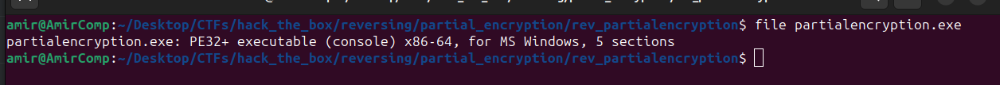
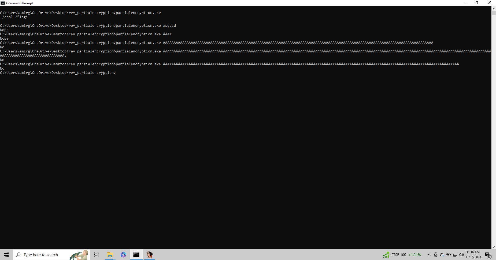
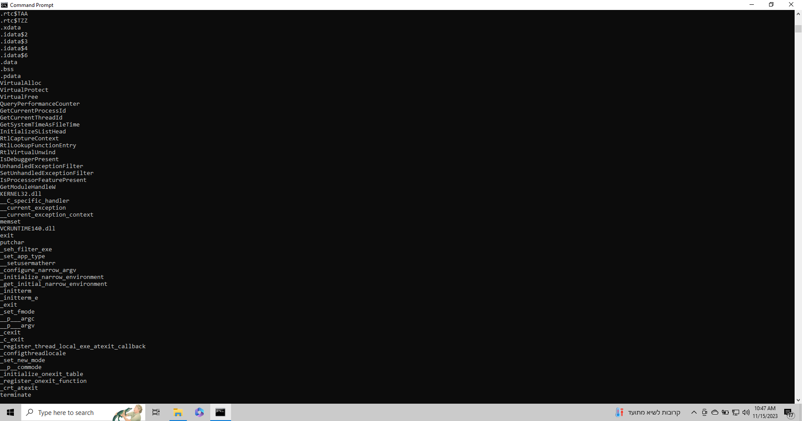
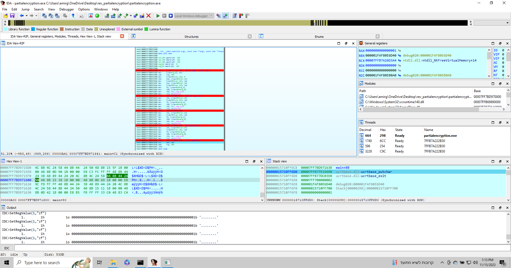
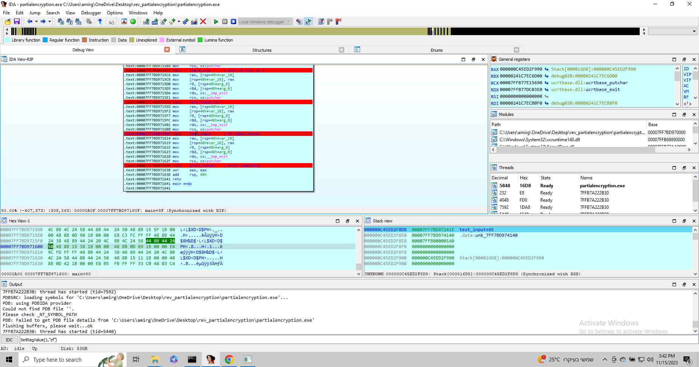
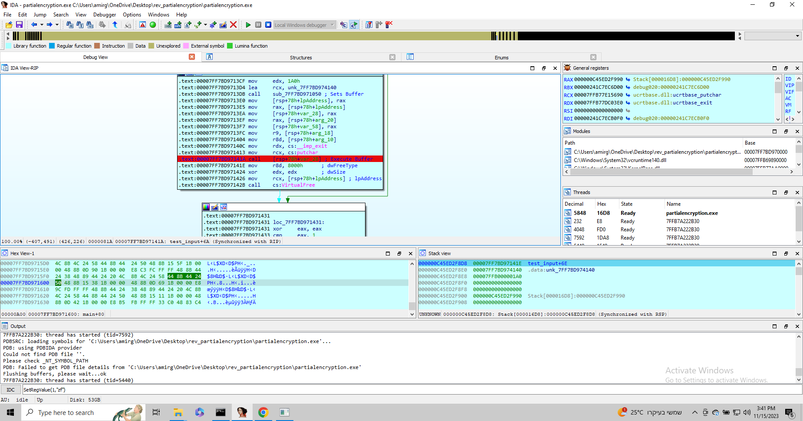
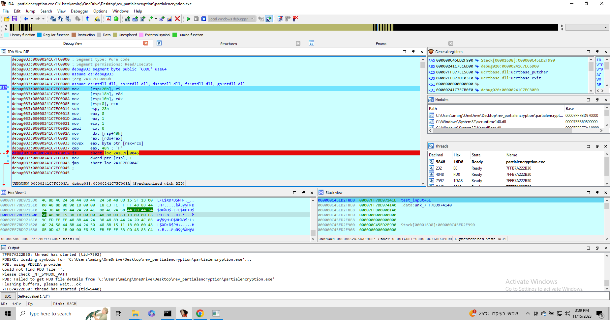

**<u>Partial Encryption:</u>**

For this challenge we recieved a zipped file containing a PE32 executable:

The description from HTB for this challenge was :
"Static-Analysis on this program didn't reveal much. There must be a better way to approach this..." so we could assume that this challenge would involve some sort of dynamic analysis of the binary (IDA is my personal favourite), but enough guesses lets go to work!

Usually when debugging and reversing PE my goto environment is FLAREVM by Mandiant, you can go check it out here if youre not familiar with it https://github.com/mandiant/flare-vm, Its basically a windows VM with as many tools as you'll probably ever need.

**Getting familiar with the binary:**

Usually before starting to dissect every inch of the binary im trying to look for clues about its flow of execution just giving it some inputs and see whats coming out at the other end, Its a much better approach in my opinion than go right ahead for analysis without getting the visual of the bigger picture.

Double clicking it didnt result to anything so I tried running it from the command line, first without any arguments than with some:

As you can see just from the few attempts above when running it without arguments the output is in the form of ./<executable_name> <argument1>  suggesting the the binary does expect a single argument, when running it with more than one argument the output is the same.

After that i tried fuzzing the input a bit to maybe look for some bufferoverflow vulnerability trying to crash it with oversized inputs but that didnt work, although one thing i noticed is that when i give the binary an argument of length 21 and smaller the output is always "Nope" and when running it with larger inputs the output is always "No".

I also tried running FLOSS to check for some interesting strings but that didnt yield much as well...

**Thoughs:**

Ok so just before openning the executable in IDA starting to really investigate we could expect to see some things:

1- There will be some sort of input validation at least for the length of it as we can see by the output ("Nope" for input.len < 21 and "No" else).

2- The binary probably expects to get a specific string to yield a valuable result such as a victory video or preferably the flag itself.

3-By the look of it the expected input is not held hardcoded in our executable since we cant see interesting result from FLOSS (this is only a guess though..).

Ok so its time for the real deal! Lets open it in IDA and look at what actually going on.

 **Dynamic analysis:**

After openning it in ida we look at the main function, where there are couple of other function calls with some wiered IDA generated names, I put break points on all of them and started to execute the file with variuos inputs to see when and where i land on each of them.

After running it a couple of times we can see the basic flow of execution.
Each function gets a pointer to putc and exit it than tests something about the input than depends on the result it either sets up some buffer as executable with VirtualAlloc and VirtualProtect ,fills up that buffer with some code generated at runtime and executes it , the code executed varies in each function.

I renamed the function accordingly as you can see:

So the test_input is the function were interested in , after checking argc == 1(check_argc) and argv[1].length > 0x16 (check_input_len) were left to validate the given input with the expected one.

Once again VirtualAlloc and VirtualProtect sets our to be executed buffer as executable ,than write code to that buffer and call it. So now the idea was to set a breaking point when our buffer is called and see how the input is validated.

When looking at the validation code we can literally see our input tested one byte at a time against a hard coded byte.
Our input start address (for now the string AAAA... 0x20 times because i needed anything larger than 0x16 to pass the previous check) stored at RAX and RCX stores the current tested byte offset.

As you can see from the picture we compare it to the ascii value of the character 'H' (0x48) and it does it for every byte of the input against the expected value which we now know is the flag itself (HTB flags always looks like 'HTB{<random bytes>}'), sincewe still dont know the expected value and its not just held as a string in our code (tested one byte at a time) my plan was to patch at runtime the ZF register to manipulate RIP to jump to the next cmp instruction each time even with a wrong byte comparison, you can either do it manually each time from the register view or runing the IDC command "SetRegValue(1,'zf')".
Now basically all there is left to do it write which byte (char) at what offset (RCX) from our input is compared against to get the flag!